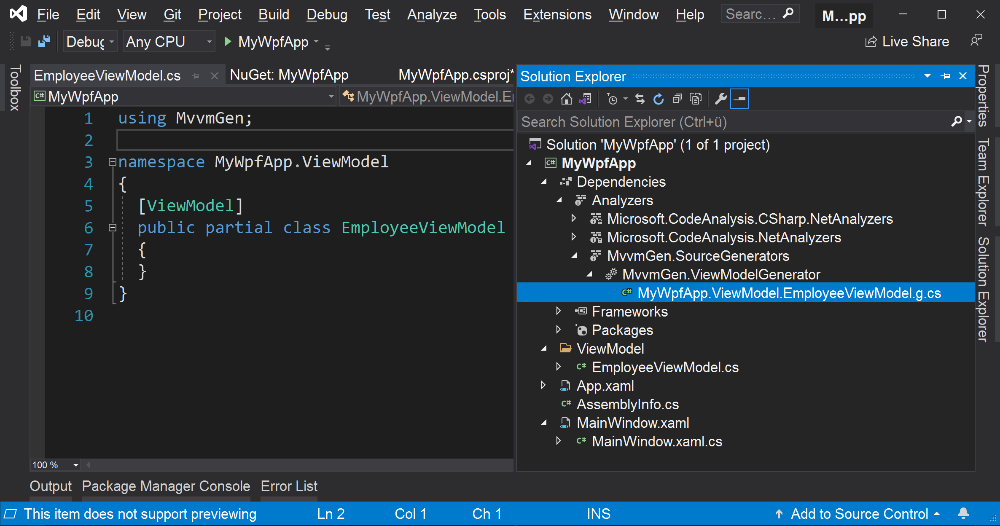

# ⚡ MvvmGen 

[](https://github.com/thomasclaudiushuber/mvvmgen/actions/workflows/build_mvvmgen.yml)
[](https://www.nuget.org/packages/Mvvmgen)
[](https://www.nuget.org/packages/Mvvmgen.PureCodeGeneration)

## Your Friend Who Writes the Boilerplate for You

Hey there, welcome to the **MvvmGen** repository. **MvvmGen** is a lightweight 
and modern MVVM library (.NET Standard 2.0) built with C# Source Generators
that helps you to apply the popular Model-View-ViewModel-pattern (MVVM) 
in your XAML applications that you build with WPF, WinUI, Uno Platform, 
Avalonia, Xamarin Forms, or .NET MAUI.

MvvmGen is licensed under the [MIT license](LICENSE).

## Get Started

- [Documentation](docs/00_start_here.md)
- [Samples](https://github.com/thomasclaudiushuber/mvvmgen-samples)
- [Blog post that introduces MvvmGen](https://www.thomasclaudiushuber.com/2021/05/12/introducing-the-mvvmgen-library)
- [Blog post about pure code generation](https://www.thomasclaudiushuber.com/2021/05/19/mvvmgen-the-special-edition-pure-code-generation)

## Quick intro

In this quick intro, you'll learn that creating a ViewModel is a lot of fun with **MvvmGen**! 🔥 

### Installing the MvvmGen NuGet Package 
Reference the NuGet package [MvvmGen](https://www.nuget.org/packages/MvvmGen/) 
in your .NET application, and then you're ready to go:
```
Install-Package MvvmGen
```  

MvvmGen will register itself as a C# source generator in your project, 
and it will be your friend who writes the boilerplate for you.

### Generating a ViewModel class

To generate a ViewModel class, you create a new class, you mark it as `partial`,
and you put MvvmGen's `ViewModel` attribute on the class:

```csharp
using MvvmGen;

namespace MyWpfApp.ViewModel
{
  [ViewModel]
  public partial class EmployeeViewModel
  {
  }
}
```

The `ViewModel` attribute tells MvvmGen to generate another
 partial `EmployeeViewModel` class. Right now, it will be a class 
that looks like this:

```csharp
using MvvmGen.Commands;
using MvvmGen.Events;
using MvvmGen.ViewModels;

namespace MyWpfApp.ViewModel
{
    partial class EmployeeViewModel : ViewModelBase
    {
        public EmployeeViewModel()
        {
            this.OnInitialize();
        }

        partial void OnInitialize();
    }
}
```

You can see that generated class in Visual Studio under Dependencies->Analyzers:


Beside the `ViewModel` attribute, you find many other attributes in the `MvvmGen` namespace 
that you can use to decorate your ViewModel class. These attributes allow you to 
build a full ViewModel like this:

```csharp
using MvvmGen;
using MvvmGen.Events;

namespace MyWpfApp.ViewModel
{
  public record EmployeeSavedEvent(string FirstName, string LastName);

  [Inject(typeof(IEventAggregator))]
  [ViewModel]
  public partial class EmployeeViewModel
  {
    [Property] private string _firstName;
    [Property] private string _lastName;

    [Command(CanExecuteMethod = nameof(CanSave))]
    private void Save()
    {
      EventAggregator.Publish(new EmployeeSavedEvent(FirstName, LastName));
    }

    [CommandInvalidate(nameof(FirstName))]
    private bool CanSave()
    {
      return !string.IsNullOrEmpty(FirstName);
    }
  }
}
```
For this ViewModel, MvvmGen will generate the following partial class definition for you
```csharp
using MvvmGen.Commands;
using MvvmGen.Events;
using MvvmGen.ViewModels;

namespace MyWpfApp.ViewModel
{
  partial class EmployeeViewModel : ViewModelBase
  {
    public EmployeeViewModel(MvvmGen.Events.IEventAggregator eventAggregator)
    {
      this.EventAggregator = eventAggregator;
      this.InitializeCommands();
      this.OnInitialize();
    }

    partial void OnInitialize();

    private void InitializeCommands()
    {
      SaveCommand = new DelegateCommand(_ => Save(), _ => CanSave());
    }

    public DelegateCommand SaveCommand { get; private set; }

    public string FirstName
    {
      get => _firstName;
      set
      {
        if (_firstName != value)
        {
          _firstName = value;
          OnPropertyChanged("FirstName");
        }
      }
    }

    public string LastName
    {
      get => _lastName;
      set
      {
        if (_lastName != value)
        {
          _lastName = value;
          OnPropertyChanged("LastName");
        }
      }
    }

    protected MvvmGen.Events.IEventAggregator EventAggregator { get; private set; }
    
    protected override void InvalidateCommands(string? propertyName)
    {
      base.InvalidateCommands(propertyName);
      if(propertyName == "FirstName")
      {
          SaveCommand.RaiseCanExecuteChanged();
      }
    }
  }
}
```

To learn all the details, go to the [documentation in this repo](docs/00_start_here.md).
