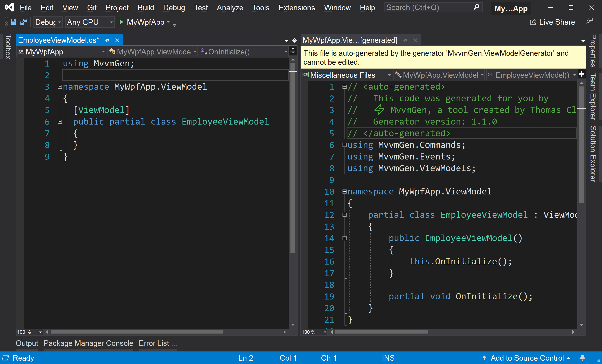

# Generate a ViewModel

In this article you learn everything about generating a ViewModel:
1. [Install the MvvmGen NuGet package](#install-the-mvvmgen-nuget-package)
2. [Generate your first ViewModel](#generate-your-first-viewmodel)
3. [Look at the Generated Code](#look-at-the-generated-code)

## Install the MvvmGen NuGet Package
To get started with MvvmGen, install the NuGet Package MvvmGen
```
dotnet add package MvvmGen
```
After that, you are ready to generate a ViewModel. 

## Generate Your First ViewModel

To generate a ViewModel with **MvvmGen**, you define a partial class 
in your code and you add the `ViewModel` attribute to it:

```csharp
using MvvmGen;

namespace MyWpfApp.ViewModel
{
  [ViewModel]
  public partial class EmployeeViewModel
  {
  }
}
```
The `ViewModel` attribute tells MvvmGen's `ViewModelGenerator` to generate
a partial `EmployeeViewModel` class that looks like below.
This generation happens on-the-fly while you type in your code editor.

```csharp
using MvvmGen.Commands;
using MvvmGen.Events;
using MvvmGen.ViewModels;

namespace MyWpfApp.ViewModel
{
    partial class EmployeeViewModel : ViewModelBase
    {
        public EmployeeViewModel()
        {
            this.OnInitialize();
        }

        partial void OnInitialize();
    }
}
```
As you can see, the generated class inherits from `ViewModelBase`. 
`ViewModelBase` is MvvmGen's base class for ViewModels. It implements the
`INotifyPropertyChanged` interface that defines the `PropertyChanged` event,
and it has a protected `OnPropertyChanged` method to raise that event from subclasses. 

> Note: You can also inherit your class directly or indirectly from
> `ViewModelBase`. Then the generated class won't inherit from `ViewModelBase`.
> This allows you to define custom base classes for your ViewModels.

The generated ViewModel class in the code snippet above has also a constructor.
From that constructor a `partial` method with the name `OnInitialize` is called.
You can implement this `partial` method in your code if you want 
to add some initialization logic:

```csharp
[ViewModel]
public partial class EmployeeViewModel
{
  partial void OnInitialize()
  {
    // Add initialization logic here
  }
}
```

# Look at the Generated Code

In Visual Studio, you can navigate to the generated code via the Solution Explorer. Expand Dependencies->Analyzers, and there you find _MvvmGen.SourceGenerators_. Expand this node and also the _MvvmGen.ViewModelGenerator_, and then you'll find there the generated _EmployeeViewModel.g.cs_ file, prefixed with the namespace like you see it in the following screenshot:


You can keep that generated file open side-by-side with your file
to see how the code is generated on-the-fly.



Important to understand is that this generated file is generated as part
of the compilation of your project. It will work as well if you build 
your project for example on the command line with the .NET CLI via
```
dotnet build
```
Also with the .NET CLI the code generation will be executed and 
the generated code gets compiled into your project. 
So, it's always generated for you.

Now, with the ViewModel ready, let's [create some properties](02_create_properties.md).
